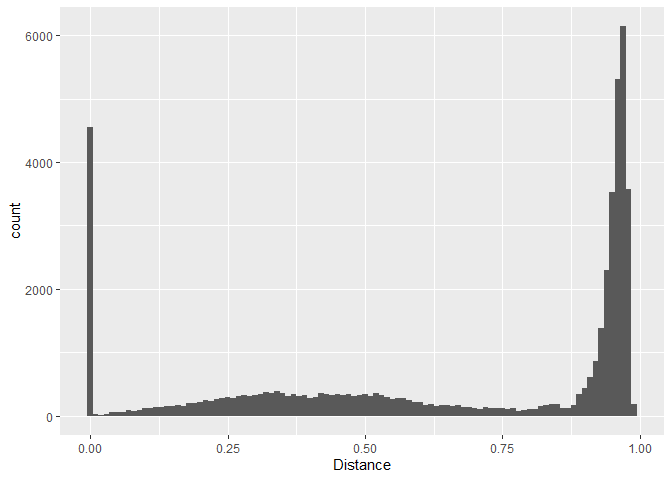
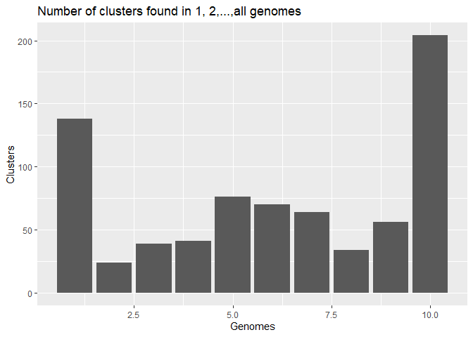
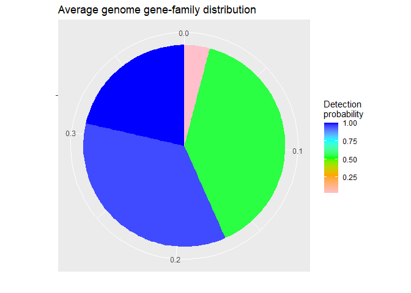
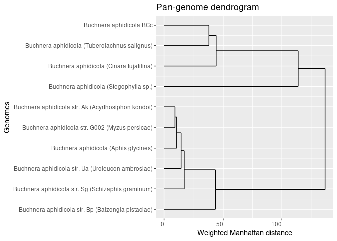
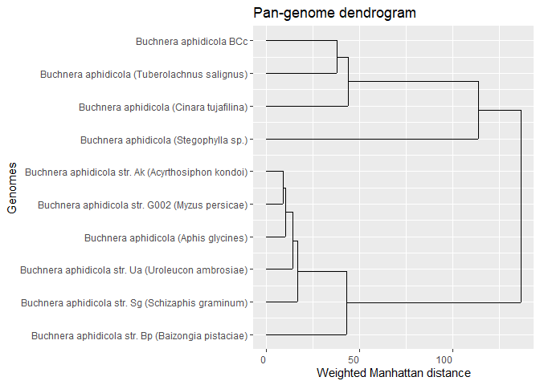
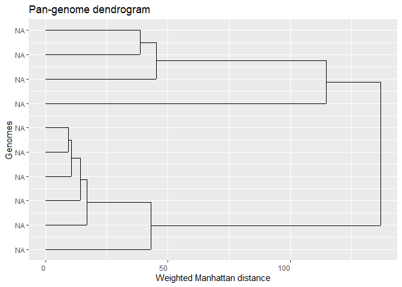

A micropan tutorial
================
Lars Snipen

Installation and citation
=========================

Install the package from CRAN (<https://cran.r-project.org/>) in the standard way, either by

``` r
install.packages("micropan")
```

or by using the Tools - Install Packages... menu in RStudio.

If you use this package, please cite [this paper](https://www.ncbi.nlm.nih.gov/pubmed/25888166).

Loading `micropan`
==================

Let us start by loading the `micropan` package

``` r
library(micropan)
```

In the code below we also make use of some other packages in some examples, let us also load these right away

``` r
library(tidyverse)  # for plotting etc
library(R.utils)    # for de-compressing files
library(ggdendro)   # plotting dendrogram tree
```

The genome data
===============

Let us first have a look at how we can download public genome data. There are many approaches, this is just one of them.

First, make a folder for this tutorial, and set this as your working directory in R.

Look up the [NCBI/Genome](https://www.ncbi.nlm.nih.gov/genome) database, and click our way to the [browsing of microbes](https://www.ncbi.nlm.nih.gov/genome/browse#!/prokaryotes/). Here we search for the species *Buchnera aphidicola*. This species has small genomes, making the computations in this tutorial fast. We download the table listing these genomes, and store it with the proper name `Buchnera_aphidicola.txt` into a subfolder named `rawdata/`.

[Here is a short video](https://mediasite.nmbu.no/Mediasite/Play/13424bec1e7a4a0e9146736830669c341d) on how to do this.

The genome table
----------------

Regardless of how you obtain the genome data, it is strongly reccomended you make a *genome table* where each row lists all relevant information about each genome in your pan-genome study. This table typically contains some name and other information for each genome, and the GID.tag required here. The latter is a unique genome identifier consisting of the text `"GID"` followed by an integer. Several of the functions in this package search for this information using the regular expression `"GID[0-9]+"`, which means you have to follow this exact pattern.

Let us read the comma-separated table we downloaded into R and

-   Select the columns we find relevant
-   Add the `GID.tag` column
-   Add a `GenBank_ID` column (see below)
-   Slice only a subset of the genomes, to speed up this tutorial

``` r
suppressMessages(read_delim("rawdata/Buchnera_aphidicola.txt", delim = ",")) %>% 
  select(Name = `#Organism Name`, Strain, Level, GenBank_FTP = `GenBank FTP`) %>% 
  mutate(GID.tag = str_c("GID", 1:n())) %>% 
  mutate(GenBank_ID = str_remove(GenBank_FTP, "^.+/")) %>% 
  slice(1:10) -> gnm.tbl
```

In this case we keep the `Name`, `Strain`, `Level` and `GenBank_FTP` address for each genome. You may of course add all types of information about the genomes as columns to this table.

The NCBI/GenBank genome FASTA files are currently stored according to a system that makes them accessible by using the URL address in the `GenBank_FTP` column only. The last term of this address is the name of the folder in which we find all GenBank data about the corresponding genome. The files in this folder typically have this as their prefix, and storing it as a separate column `GenBank_ID` makes later code somewhat shorter.

At the time of writing this table contains 65 genomes. To make faster computations in this tutorial, we slice the table down to only the 10 first genomes. You may run with the full table if you like, but this will take (much) longer time.

Downloading
-----------

We are ready to start downloading, and here is some code to do the job. The genome filenames consists of the `GenBank_ID` and the suffix `_genomic.fna.gz`, at least at the time of writing. Note that we also immediately uncompress the files (using `gunzip()` from the `R.utils` package), since this will be a benefit later.

``` r
for(i in 1:nrow(gnm.tbl)){
  filename <- str_c(gnm.tbl$GenBank_ID[i], "_genomic.fna.gz")
  download.file(url = file.path(gnm.tbl$GenBank_FTP[i], filename),
                destfile = file.path("rawdata", filename))
  gunzip(file.path("rawdata", filename), overwrite = T)
}
```

We could also have done this by using the accession numbers in the columns `Replicons` and `WGS` of the downloaded table, and the functions `entrezDownload()` and `getAccessions()` in this R package. They will download from the Nucleotide database, resulting in uncompressed FASTA files.

A note on compressed files: Below we make use of the software *prodigal* to find genes, and this cannot take compressed fasta files as input. For reading or writing files in R using `readFasta()` or `writeFasta()` you may very well work with compressed files.

Finding coding genes
====================

A pan-genome analysis focuses on the coding genes from each genome. Finding these coding genes is a very crucial step for many downstream analyses. Prokaryotic gene finders will usually find most coding genes, but not perfectly. Let us first illustrate this.

Gene scores
-----------

We will use the function `findGenes()` from the `microseq` package for this job. This implements the [prodigal](https://github.com/hyattpd/Prodigal) gene finding software, which is very popular. Let us use as input a 'genome' consisting of 1 million basepairs of uniform random DNA. We make a subfolder `tmp/` for storing temporary files, and put this rubbish 'genome' into it

``` r
dir.create("tmp")
set.seed(2020)
tibble(Header = "Random_noise",
       Sequence = str_c(sample(c("A","C","G","T"), size = 1e+6, replace = T), collapse = "")) %>% 
  writeFasta(out.file = "tmp/random.fna")
```

Then we do the gene finding from these data:

``` r
gff.tbl <- findGenes("tmp/random.fna")
```

    ## Warning: The `x` argument of `as_tibble.matrix()` must have column names if `.name_repair` is omitted as of tibble 2.0.0.
    ## Using compatibility `.name_repair`.
    ## This warning is displayed once every 8 hours.
    ## Call `lifecycle::last_warnings()` to see where this warning was generated.

The resulting GFF-table lists more than 1000 genes, even if the input is completely rubbish! It is quite typical of gene finding softwares that they tend to 'find genes' even if there are none. There are many good reasons for designing them over-sensitive like this, but for pan-genome studies it is not beneficial. However, this table also has a column `Score` given by [prodigal](https://github.com/hyattpd/Prodigal) to each of these 'genes'. A histogram of these scores shows

``` r
fig1 <- ggplot(gff.tbl) +
  geom_histogram(aes(x = Score), bins = 50) +
  labs(title = "Random DNA")
print(fig1)
```


that the largest scores are just over 30, and none are above 40. If we use the same procedure on the first real genome

``` r
gff.tbl <- findGenes(file.path("rawdata", str_c(gnm.tbl$GenBank_ID[1], "_genomic.fna")))
fig2 <- ggplot(gff.tbl) +
  geom_histogram(aes(x = Score), bins = 50) +
  labs(title = "Real genome")
print(fig2)
```


we notice that most genes have scores well above 40, but a few have a very low score, and may be discarded. Such low-scoring gene predictions are likely to be errors, and will affect some of our downstream analyses. These typically end up as *cloud genes* in the pan-genome, and will affect estimates on pan-genome size and openness severely.

The proteins and `panPrep()`
----------------------------

Let us use a cutoff of score 40, to discard the most uncertain gene predictions. We then extract the coding genes from the genome and translate them into protein, and store this into the `tmp/` folder:

``` r
for(i in 1:nrow(gnm.tbl)){
  genome <- readFasta(file.path("rawdata", str_c(gnm.tbl$GenBank_ID[i], "_genomic.fna"))) # for use below
  findGenes(file.path("rawdata", str_c(gnm.tbl$GenBank_ID[i], "_genomic.fna"))) %>% 
    filter(Score > 40) %>% 
    gff2fasta(genome) %>% 
    mutate(Sequence = translate(Sequence)) %>% 
    writeFasta(file.path("tmp", str_c(gnm.tbl$GenBank_ID[i], ".faa")))
}
```

Notice we change the filename extension to `.faa` once we have FASTA files with amino acid sequences.

Before we are done with this part, we need to *prepare* the files for later, using the `panPrep()` function. This is where we need the `GID.tag` information. We create a new subfolder for these prepped protein files:

``` r
dir.create("faa")
for(i in 1:nrow(gnm.tbl)){
  panPrep(file.path("tmp", str_c(gnm.tbl$GenBank_ID[i], ".faa")),
          gnm.tbl$GID.tag[i],
          file.path("faa", str_c(gnm.tbl$GenBank_ID[i], ".faa")))
}
```

Inspect the FASTA files in the `faa/` subfolder to verify they contain proper protein sequences, and that the `GID.tag` information has been added to each filename as well as to the first token of each `Header` in the FASTA files. Here is the top of the first file:

``` r
readFasta(file.path("faa", str_c(gnm.tbl$GenBank_ID[1], "_", gnm.tbl$GID.tag[1], ".faa"))) %>% 
  head()
```

    ## # A tibble: 6 x 2
    ##   Header                           Sequence                                     
    ##   <chr>                            <chr>                                        
    ## 1 GID1_seq1 Seqid=AE013218.1;Star~ MSKSYLKNFDVIVIGGGHAGTEAAAASARVGCKTLLLTQKITDI~
    ## 2 GID1_seq2 Seqid=AE013218.1;Star~ MSLEKISNPQKYISHHLNHLQIDLCNFKFVEPGKIVSHFWVLNI~
    ## 3 GID1_seq3 Seqid=AE013218.1;Star~ MESLNVDMLYIAVAIMIGLAAIGAAIGIGILGSKFLEGAARQPD~
    ## 4 GID1_seq4 Seqid=AE013218.1;Star~ MNLNATILGQALSFILFVWFCMKYIWPPIIFAIETRQKNIEESL~
    ## 5 GID1_seq5 Seqid=AE013218.1;Star~ MSVLDTIARPYAKAIFELAIENQSIEKWKKTLIFINEIIRSKKI~
    ## 6 GID1_seq6 Seqid=AE013218.1;Star~ MQLNSTEISQLIKERIAQFEVFNQSYNEGTIISVNDGIIKIYGL~

Instead of having two loops as we did here (to make it very transparent) you could have added the `panPrep()` to the first loop to save some time and code.

Gene families using BLAST
=========================

Grouping genes/proteins into gene families is a central part of a pan-genome analysis. Clustering sequences means we need some measure of *distance* between them. Let us find gene families using BLAST.

The `blastpAllAll()`
--------------------

The idea is to use BLAST to align all proteins against all proteins, and from this compute a distance between all pairs. Most proteins do *not* align, and only those who do have a similarity we take interest in. We make a new subfolder `blast/` and use the `blastpAllAll()` function to compare all proteins against all other proteins, writing the resulting files to this new folder:

``` r
dir.create("blast")
faa.files <- list.files("faa", pattern = "\\.faa$") # assuming no other faa-files in this folder
blastpAllAll(file.path("faa", faa.files), out.folder = "blast", verbose = F)
```

This step is the most time consuming in such analyses, and setting `verbose = T` may be a good idea, to monitor the progress. You may also speed things up by using multiple threads (the `threads` argument) or by starting several R-sessions, and let each session run the same code. In the latter case you must use the `job` option, and give it a unique integer for each R session, i.e. if you run 3 sessions, you use `job=1`, `job=2` and `job=3` in the different sessions. Let them all write to the same `out.folder`, and they will not over-write each other.

Storing such results in files in a separate subfolder is a good idea. If you choose to add more genomes later, these results are already there, and will not be re-computed. Never put any other files into this folder! If you want to re-compute everything, delete the files in the `out.folder` first.

Distances by `bDist()`
----------------------

Based on the results from above we compute distances between all proteins. Actually, most proteins have no similarity at all, and we only compute those distances who are detectable by BLAST, i.e. produce a BLAST alignment.

``` r
dst.tbl <- bDist(file.path("blast", list.files("blast", pattern = "txt$")))
```

    ## readBlastSelf:
    ##    ...received 55 blast-files...
    ##    ...found 10 self-alignment files...
    ##    ...returns 10716 alignment results
    ## readBlastPairs:
    ##    ...received 55 blast-files...
    ##    ...found 45 alignment files who are NOT self-alignments...
    ##    ...returns 42342 alignment results
    ## bDist:
    ##    ...found 47803 alignments...
    ##    ...where 4542 are self-alignments...

Notice how we use *all* result files in the `blast/` subfolder as input here. Thus, you need this set of results to be complete, and there should be no other files in this folder. Make several folders if you want to have results for various collections of genomes!

The resulting table has four columns. The two first (`Query`and `Hit`) lists sequence tags, i.e. each row is a protein pair. The third column is the alignment `Bitscore` and the last column is the `Distance` we are interested in. All pairs *not* listed have distance 1.0 between them, i.e. share no detectable similarity at all.

We may plot a histogram of these distances, to get a picture of how similar the proteins tend to be

``` r
fig3 <- ggplot(dst.tbl) +
  geom_histogram(aes(x = Distance), bins = 100)
print(fig3)
```



We notice:

-   Some pairs are identical, and most of these are self-alignments. All proteins are identical (`Distance` is 0.0) to themselves.
-   Many distance are large, close to 1.0. We could have lowered the E-value threshold in `bDist()` to eliminate many of these right away.

The distances below 0.75 are the ones we are most interested in. In order to cluster we need to set some distance threshold somewhere, and from this histogram a value of 0.75 seems like a good start. This is a rather large threshold, and we should be prepared to use a smaller value if this results in very few and very large clusters.

For huge data sets
------------------

If you have many genomes, say more than 100, you may find the reading of the files takes quite some time. Then you may do this in a separate step, using `readBlastSelf()` and `readBlastPair()` and save their results to some `.RData` files. This means you can read chunks of files and perhaps run it in parallell. These functions will return tables of BLAST results that you bind together into one long table and use as input to `bDist()` instead of the filenames, using the argument `blast.tbl` instead of `blast.files` in `bDist()`. Here is how we may do it, using the small example:

``` r
self.tbl <- readBlastSelf(file.path("blast", list.files("blast", pattern = "txt$")))
```

    ## readBlastSelf:
    ##    ...received 55 blast-files...
    ##    ...found 10 self-alignment files...
    ##    ...returns 10716 alignment results

``` r
pair.tbl <- readBlastPair(file.path("blast", list.files("blast", pattern = "txt$")))
```

    ## readBlastPairs:
    ##    ...received 55 blast-files...
    ##    ...found 45 alignment files who are NOT self-alignments...
    ##    ...returns 42342 alignment results

``` r
dst.tbl <- bDist(blast.tbl = bind_rows(self.tbl, pair.tbl))
```

    ## bDist:
    ##    ...found 47803 alignments...
    ##    ...where 4542 are self-alignments...

The `self.tbl` is never super-big, but the `pair.tbl` may have many million rows. Instead of giving it all files to read, it may be possible to speed things up by processing many chunks in parallell. Still, the `bDist()` will need all rows in the end and you may run out of memory if the number of genomes is too large.

Clustering by `bClust`
----------------------

The `bClust()` uses classical hierarchical clustering based on the distances we computed above. We can specify the `linkage` function to use. The `complete` linkage is the 'strictest' way of clustering, in the sense that no distance between two members can exceed the threshold we specify. It is often a good choice to use

-   A `complete` linkage clustering
-   And a rather libral (large) threshold

The `complete`linkage means we have exact control of the 'radius' of our clusters ore gene families. The other linkages are less transparent in this sense.

Let us try this:

``` r
clst.blast <- bClust(dst.tbl, linkage = "complete", threshold = 0.75)
```

This results in 746 gene families or clusters. The largest cluster has 14 members, which is not very large given we have 10 genomes, and all core gene families should have at least 10 members. If many of the largest clusters become huge compared to the number of genomes, the threshold is probably too liberal (too large).

Note that the clustering vector `clst.blast` contains, in its names, the unique information to identify a protein and the genome from which it comes. Let us briefly have a look at which proteins belong to cluster 1:

``` r
print(clst.blast[clst.blast == 1])
```

    ##  GID1_seq1 GID10_seq1  GID2_seq1  GID3_seq1  GID4_seq1  GID5_seq1  GID6_seq1 
    ##          1          1          1          1          1          1          1 
    ##  GID7_seq1  GID8_seq1  GID9_seq1 
    ##          1          1          1

We notice this cluster has exactly one member from each genome (all 10 `GID.tag`s), a 'perfect' core gene.

The pan-matrix
==============

The fundamental data structure for many pan-genome analyses is the pan-matrix. This is simply a matrix with one row for each genome and one column for each gene cluster. The only input required is the clustering vector from above:

``` r
panmat.blast <- panMatrix(clst.blast)
```

Once we have the pan-matrix, we can make a bar-chart over how many clusters are found in 1,2,...,all genomes:

``` r
tibble(Clusters = as.integer(table(factor(colSums(panmat.blast > 0),
                                          levels = 1:nrow(panmat.blast)))),
       Genomes = 1:nrow(panmat.blast)) %>% 
  ggplot(aes(x = Genomes, y = Clusters)) +
  geom_col() + labs(title = "Number of clusters found in 1, 2,...,all genomes")
```



Pan-genome size
---------------

How big is the pan-genome? We are not talking about the number of gene clusters in the current sample, because this is just the number of columns in the pan-matrix. The size of the pan-genome is the number of gene clusters we would see if we collected *all* genomes of the species, not just the current sample. Will the number of clusters grow forever, or will it level out?

The `heaps()` function gives some estimate of pan-genome openness:

``` r
heaps.est <- heaps(panmat.blast, n.perm = 500)
```

According to the theory the pan-genome is closed if the estimated `alpha` is above 1.0:

``` r
print(heaps.est)
```

    ##  Intercept      alpha 
    ## 283.942276   1.479329

which is the case here. This means the growth of new gene clusters as we sample more and more genomes tend to level off, see the Help-file for `heaps()` for more details.

So how big does it look like this pan-genome will be? The `chao()` shed some light on this:

``` r
print(chao(panmat.blast))
```

    ## [1] 1143

which is an estimate of the total number of gene clusters for this species. When based on only 10 genomes, this is a rather uncertain estimate!

An alternative estimate is found by fitting binomial mixture models to the data:

``` r
fitted <- binomixEstimate(panmat.blast, K.range = 3:8)
```

    ## binomixEstimate: Fitting 3 component model...
    ## binomixEstimate: Fitting 4 component model...
    ## binomixEstimate: Fitting 5 component model...
    ## binomixEstimate: Fitting 6 component model...
    ## binomixEstimate: Fitting 7 component model...
    ## binomixEstimate: Fitting 8 component model...

By inspecting the fitted `BIC.tbl` we can see how many mixture components is supported best by these data:

``` r
print(fitted$BIC.tbl)
```

    ## # A tibble: 6 x 4
    ##   K.range Core.size Pan.size   BIC
    ##     <dbl>     <dbl>    <dbl> <dbl>
    ## 1       3       201      966 3247.
    ## 2       4       115     1214 3177.
    ## 3       5        71     1641 3185.
    ## 4       6         0     1427 3199.
    ## 5       7         0     1460 3212.
    ## 6       8         0     1310 3226.

The minimum BIC-value is found at 4 components, indicating an optimum here. We also see that in this row the estimate of pan-genome size is 1160, and the size of the core-genome is 97.

The 4 components means we can actually group gene clusters into 4 categories with respect to how frequent they tend to occur in the genomes. This may also be plotted:

``` r
ncomp <- 4
fig4 <- fitted$Mix.tbl %>% 
  filter(Components == ncomp) %>% 
  ggplot() +
  geom_col(aes(x = "", y = Mixing.proportion, fill = Detection.prob)) +
  coord_polar(theta = "y") +
  labs(x = "", y = "", title = "Pan-genome gene family distribution",
       fill = "Detection\nprobability") +
  scale_fill_gradientn(colors = c("pink", "orange", "green", "cyan", "blue"))
print(fig4)
```



We see that roughly half the pan-genome consists of the pink 'cloud-genes' with very low detection probability, i.e. gene clusters seen in very few genomes only. Also, in addition to the core-genes always observed, there is a component of almost-core-genes, seen in almost all genomes. Note that in `binomixEstimate()` you may set the `core.detection.prob` (slightly) lower than 1.0 to allow core-genes to be absent from some genomes. This is reasonable if we have incomplete genomes, genes may be there but is not detected due to incomplete sequence data.

The figure above is for the entire pan-genome, but how does it look like in one (average) genome? Like this:

``` r
fig5 <- fitted$Mix.tbl %>% 
  filter(Components == ncomp) %>% 
  mutate(Single = Mixing.proportion * Detection.prob) %>%
  ggplot() +
  geom_col(aes(x = "", y = Single, fill = Detection.prob)) +
  coord_polar(theta = "y") +
  labs(x = "", y = "", title = "Average genome gene-family distribution",
       fill = "Detection\nprobability") +
  scale_fill_gradientn(colors = c("pink", "orange", "green", "cyan", "blue"))
print(fig5)
```



As extected, in a single genome the 'cloud-genes' (pink) are rare.

Relation between genomes
------------------------

From the pan-matrix we may also compute distances between genomes:

``` r
d.man <- distManhattan(panmat.blast)
```

and from these we make a dendrogram tree to visualize their relations:

``` r
ggdendrogram(dendro_data(hclust(d.man, method = "average")),
             rotate = TRUE, theme_dendro = FALSE) +
  labs(x = "Genomes", y = "Manhattan distance", title = "Pan-genome dendrogram")
```



The Manhattan distance is simply how many gene clusters have differing presence/absence status between two genomes, but remember the distances displayed in the tree are average linkage distances between clusters. Change the linkage by changing `method = "average"` in the call to `hclust()`.

Since the 'cloud-genes' tend to be of a less reliable nature (gene prediction errors), it may be a good idea to *weight* the distance such that differences in the 'shell-genes' (green sectors above) presence/absence becomes more important. Here is how we can do this, and at the same time we also replace the `GID.tag` labels by their corresponding `Name`:

``` r
pm <- panmat.blast                                                 # make a copy
rownames(pm) <- gnm.tbl$Name[match(rownames(pm), gnm.tbl$GID.tag)] # new rownames
weights <- geneWeights(pm, type = "shell")
distManhattan(pm, weights = weights) %>% 
  hclust(method = "average") %>% 
  dendro_data() %>% 
  ggdendrogram(rotate = TRUE, theme_dendro = FALSE) +
  labs(x = "Genomes", y = "Weighted Manhattan distance", title = "Pan-genome dendrogram")
```



There are of course many variations of this dendrogram, by using other distances, different weighting etc.

Grouping proteins by domains
============================

An alternative to the BLAST procedure above is to search all proteins for *domains* and group them by which sequence of domains they contain. The advantage is that we do not need to decide any thresholds, and the approach is robust to gene prediction errors, since rubbish genes tend not to contain any domains. The problem compared to the BLAST approach is lower resolution, and that not all proteins are grouped.

The `hmmerScan()`
-----------------

The [HMMER software](http://hmmer.org/) is needed here. This is only built for UNIX-like systems, but there are some possibilities of running it under windows as well, see [its documentation](http://hmmer.org/documentation.html). We also need a domain database to scan against, and the natural choice is the [Pfam-A database](https://pfam.xfam.org/). Any database based on the HMMER software is useful.

We assume you have downloaded and unpacked the `Pfam-A.hmm` file, stored this in some folder and run `hmmpress` on it. We use the `hmmerScan()` function to do the search:

``` r
pfam.db <- "~/projects/publicdata/Pfam/Pfam-A.hmm"
dir.create("pfam")
hmmerScan(file.path("faa", str_c(gnm.tbl$GenBank_ID, "_", gnm.tbl$GID.tag, ".faa")),
          dbase = pfam.db,
          out.folder = "pfam")
```

Note that the content of `pfam.db` in the code above needs to be edited to match where you have this database on your system.

Just like BLASTing, this is a time consuming step, and results are stored in the subfolder `pfam/` for later. If you add more genome later, you simply re-run this code, and the existing result files will not be re-computed.

Domain sequence clustering
--------------------------

First we read all results from the step above, i.e. the Pfam-A domains found in all proteins. We also use the `hmmerCleanOverlap()` to discard overlapping domains. In some cases two or more domains match the same region of the protein. In such cases we only keep the best matching domain.

``` r
pfam.files <- list.files("pfam", pattern = "txt$")
hmmer.tbl <- NULL
for(i in 1:length(pfam.files)){
  readHmmer(file.path("pfam", pfam.files[i])) %>% 
    hmmerCleanOverlap() %>% 
    bind_rows(hmmer.tbl) -> hmmer.tbl
}
```

The full table has 7403 rows, which is the number of times a protein has a hit against a domain. Many proteins have several domain hits. The *domain sequence* of a protein is the ordered sequence of domains appearing in it.

We cluster the proteins based on their domain sequences. Only proteins having identical domain sequences are in the same cluster:

``` r
clst.pfam <- dClust(hmmer.tbl)
```

The number of clusters is simply the number of unique values in `clst.pfam`

``` r
length(unique(clst.pfam))
```

    ## [1] 669

Replace the `clst.blast` by this `clst.pfam`, and all examples above may be repeated.
